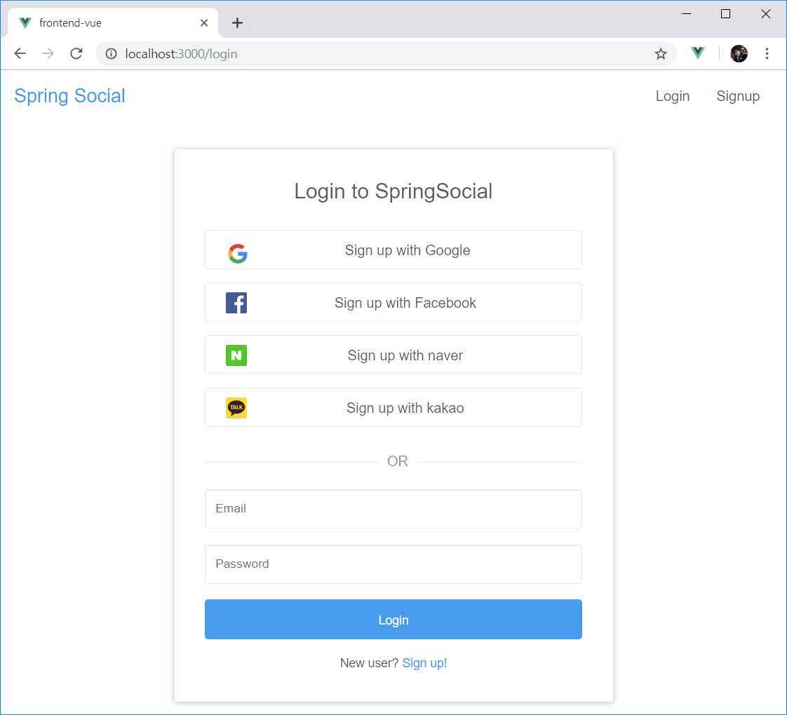
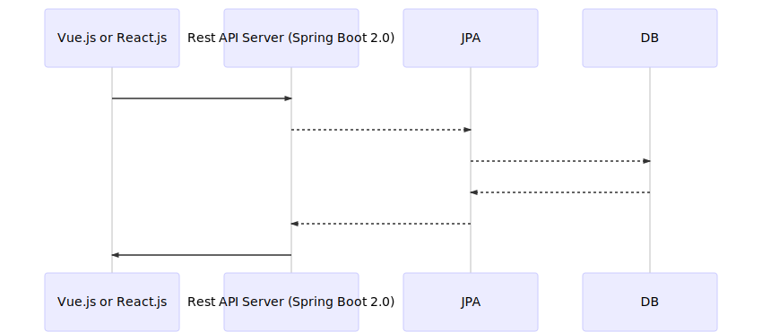
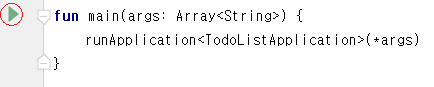
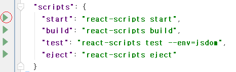
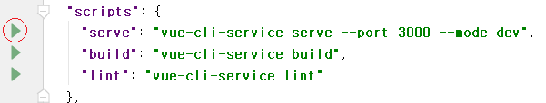

#TodoList
spring 2.0을 사용하고 소셜로그인(네이버, 다음, 구글, 페이스북) 인증을 구현한 데모 엡입니다.

vue.js나 react.js를 프론트단으로 하고 spring boot를 rest API서버로 사용하고 있습니다




* 구조


> 이 프로젝트는 백엔드 서버와 프론트엔드 서버로 구성되어 있습니다<br>
> 프론트엔드 서버는 UI를 담당하며 벡엔드서버와 Rest API 통신을 합니다
 

##목표

- Spring 2.0를 사용하여 Rest API 서버 구현
- JPA를 사용하여 디비 쿼리
- React.js를 사용하여 화면 구성
- Vue.js를 사용하여 동일한 화면 구성
- 스프링과 vue의 프로젝트 구조의 이해
- 코틀린을 활용한 spring boot 구현
- 소셜로그인 (네이버, 다음, 구글, 페이스북)

##  적용기술

- Intellij IDE 기반
- React.js
- Vue.js 2.0
- Spring boot 2.0
- kotlin
- Spring Data JPA
- Spring Security Oauth2 client
   > **Note:** Spring Security Oauth2 client는 spring boot 2.0에서 새로 도입된 기술이며 1.5에서 사용하는 Oauth2Client와는 다른 기술입니다 
- MySQL

## 프로젝트 구성 및 빌드
이 프로젝트는 3개의 하위 프로젝트를 가집니다
1. **스프링 부트:** 그레이들 기반의 프로젝트로 root에 위치 합니다. 
2. **frontend-react:** React.js 기반의 UI 프로젝트로 frontend-react 하위디렉토리로 존재 합니다 
3. **frontend-vue:** Vue.js 기반의 UI 프로젝트로 frontend-vue 하위디렉토리로 존재 합니다
   > **Note:** frontend-react와 frontend-vue는 동일한 역할을 합니다
   
### 스프링 부트 빌드

+ **데이터 베이스 만들기**

	```bash
	mysql> create database spring_social
	```

+ **데이터 베이스 설정**

	```yml
	# todolist/src/main/resources/application.yml
	spring:
	    datasource:
	        url: jdbc:mysql://localhost:3306/spring_social?useSSL=false
	        username: <YOUR_DB_USERNAME>
	        password: <YOUR_DB_PASSWORD>
	```

+ **Specify OAuth2 Provider ClientId's and ClientSecrets**
+ **클라이언트 ID와 클라이언트 시크릿 설정**
	
	```yml
    security:
      oauth2:
        client:
          registration:
            google:
              clientId: <GOOGLE_CLIENT_ID>
              clientSecret: <GOOGLE_CLIENT_SECRET>
              redirectUriTemplate: "{baseUrl}/oauth2/callback/{registrationId}"
              scope:
                - email
                - profile
            facebook:
              clientId: <FACEBOOK_CLIENT_ID>
              clientSecret: <FACEBOOK_CLIENT_SECRET>
              redirectUriTemplate: "{baseUrl}/oauth2/callback/{registrationId}"
              scope:
                - email
                - public_profile
            github:
              clientId: <GITHUB_CLIENT_ID>
              clientSecret: <GITHUB_CLIENT_SECRET>
              redirectUriTemplate: "{baseUrl}/oauth2/callback/{registrationId}"
              scope:
                - user:email
                - read:user
            naver:
              clientName: naver
              clientId: <NAVER_CLIENT_ID>
              clientSecret: <NAVER_CLIENT_SECRET>
              authorization-grant-type: authorization_code
              redirectUriTemplate: "{baseUrl}/oauth2/callback/{registrationId}"
              scope:
                - email
                - profile_image
            kakao:
              clientName: kakao
              clientId: <KAKAO_CLIENT_ID>
              authorization-grant-type: authorization_code
              redirectUriTemplate: "{baseUrl}/oauth2/callback/{registrationId}"
              client-authentication-method: POST
              scope:
                - account_email
                - profile
          provider:
            facebook:
              authorizationUri: https://www.facebook.com/v3.0/dialog/oauth
              tokenUri: https://graph.facebook.com/v3.0/oauth/access_token
              userInfoUri: https://graph.facebook.com/v3.0/me?fields=id,first_name,middle_name,last_name,name,email,verified,is_verified,picture.width(250).height(250)
            naver:
              authorizationUri: https://nid.naver.com/oauth2.0/authorize
              tokenUri: https://nid.naver.com/oauth2.0/token
              userInfoUri: https://openapi.naver.com/v1/nid/me
              user-name-attribute: response
            kakao:
              authorizationUri: https://kauth.kakao.com/oauth/authorize
              tokenUri: https://kauth.kakao.com/oauth/token
              userInfoUri: https://kapi.kakao.com/v2/user/me
              user-name-attribute: id
	```

	> 클라이언트 ID와 시크릿은 각 Oauth2 인증 사이트에서 발급 받으실 수 있으며, 본 프로젝트에서는 바로 테스트할 수 있도록 클라이언트 ID와 시크릿이 포함되어 있습니다  
	
+ **스프링 Rest API 서버 기동**

	
	```
	intellij IDE 내부에서
	# todolist/src/main/kotlin/com/gondev/todolist/TodoListApplication.kt
	main() 함수 왼쪽의 녹색 화살표 클릭
	```

### frontend-react 설정
1. [Node.js](https://nodejs.org/ko/) 설치
2. 라이브러리 설치
   ```
   cd frontend-react
   npm intall
   ```
3. frontend-react 서버 기동

	
	```
	intellij IDE 내부에서
	# todolist/frontend-react/package.json
	"start" 항목 왼쪽의 녹색 화살표 클릭
	```

### frontend-vue 설정
1. [Node.js](https://nodejs.org/ko/) 설치
2. 라이브러리 설치
   ```
   npm install -g @vue/cli
   cd frontend-vue
   npm intall
   ```
3. frontend-vue 서버 기동

	
	```
	intellij IDE 내부에서
	# todolist/frontend-vue/package.json
	"serve" 항목 왼쪽의 녹색 화살표 클릭
	```

## 참고 서적 및 소스 출처

- 베이스 소스: https://github.com/callicoder/spring-boot-react-oauth2-social-login-demo
- 참고 소스: https://github.com/pravusid/springboot-vue.js-bbs
- 참고 서적: [Do it! Vue.js 입문 (장기호)](https://book.naver.com/bookdb/book_detail.nhn?bid=13256615), [처음 배우는 스프링 부트 2 (김영재)](https://book.naver.com/bookdb/book_detail.nhn?bid=14031681)
