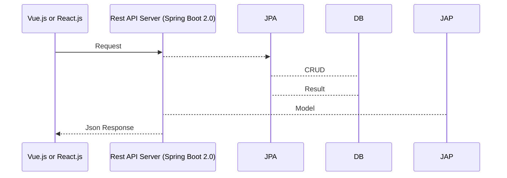

#TodoList
spring 2.0을 사용하고 소셜로그인(네이버, 다음, 구글, 페이스북) 인증을 구현한 데모 엡입니다.

vue.js나 react.js를 프론트단으로 하고 spring boot를 rest API서버로 사용하고 있습니다

##목표

- spring 2.0의 이해
- vue.js의 이해
- 스프링과 vue의 프로젝트 구조의 이해
- 코틀린을 활용한 spring boot 구현
- 소셜로그인 (네이버, 다음, 구글, 페이스북)

##  적용기술

- Intellij IDE 기반
- React.js
- Vue.js 2.0
- Spring boot 2.0
- kotlin
- Spring Data JPA
- Spring Security Oauth2 client
- MySQL

## 참고 서적 및 소스 출처

- 베이스 소스: https://github.com/callicoder/spring-boot-react-oauth2-social-login-demo
- 참고 소스: https://github.com/pravusid/springboot-vue.js-bbs
- 참고 서적: [Do it! Vue.js 입문 (장기호)](https://book.naver.com/bookdb/book_detail.nhn?bid=13256615), [처음 배우는 스프링 부트 2 (김영재)](https://book.naver.com/bookdb/book_detail.nhn?bid=14031681)

## 프로젝트 구성 및 빌드
